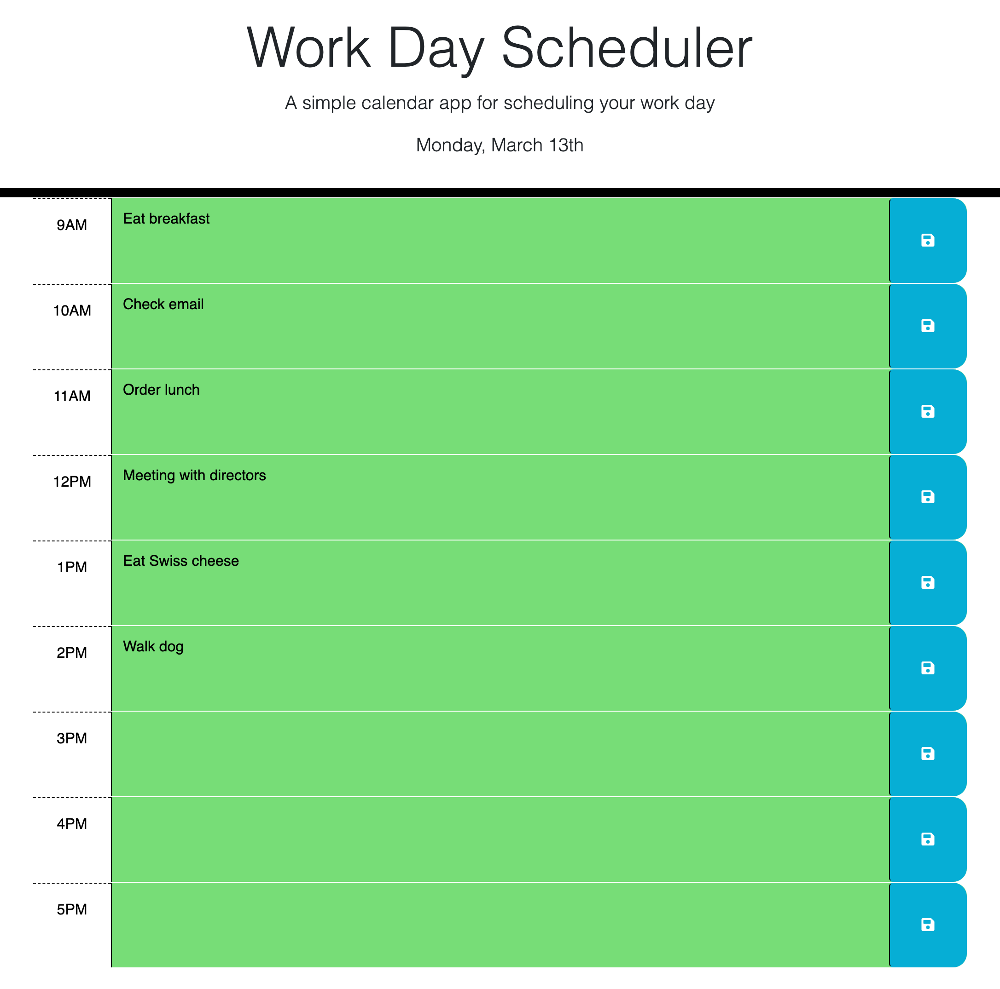

# Work Day Scheduler

## Description
This web application was created to generate an interactive calendar that a user can add events to that will be saved to local storage on their machine so that they can be viewed at a later time.

## Usage
When the web app is loaded a blank calendar is presented to the user with the current date at the top. When the user enters an event and clicks the save button in that time block, the event is saved to local storage so that the user can view their events for the day after closing the app.

You can visit the website [here](https://jakefair97.github.io/work-day-scheduler/) and view a screenshot of the webpage below:

## Credits
The app was designed by George (@Georgeyoo), matt fyke (@mfyke), and Courtney Mathena (@cmathena2u).

## License
Please refer to the LICENSE in the repo.
